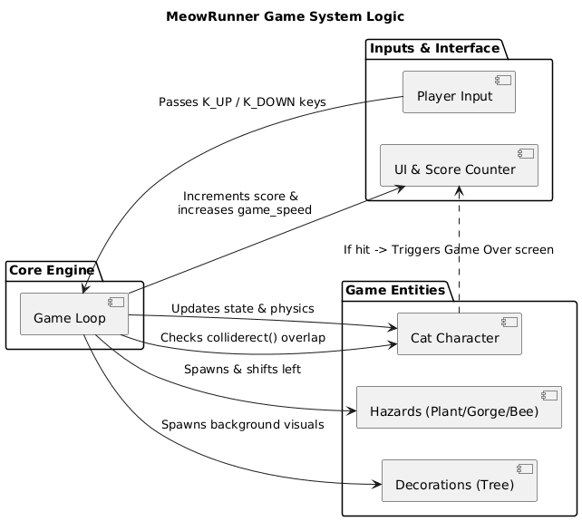
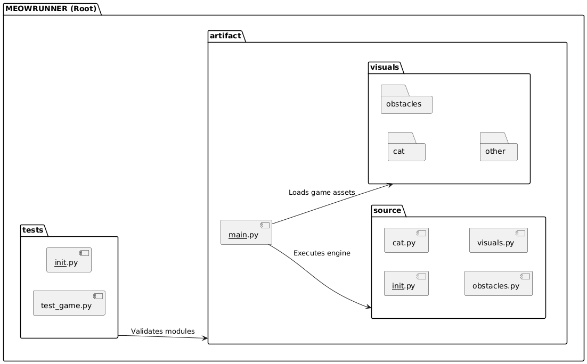
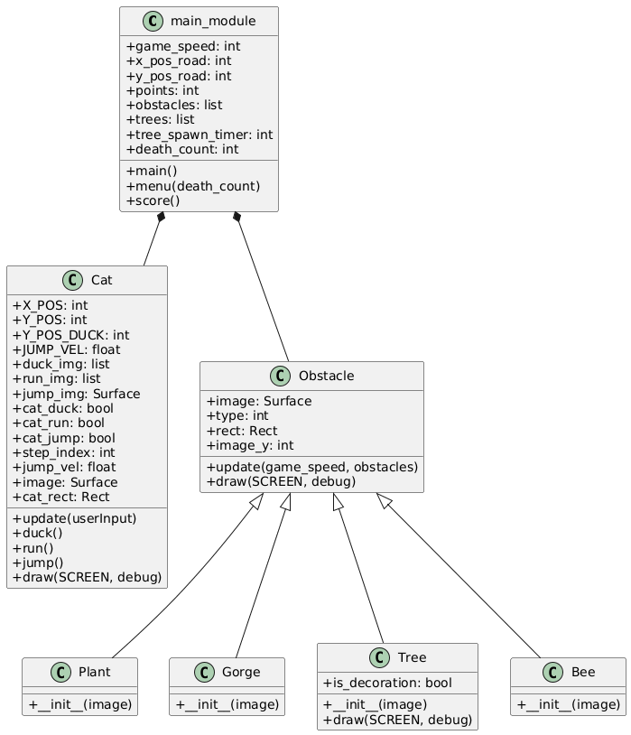

# Design

## Architecture 
The system follows a **Game Loop Architectural Pattern** combined with **Object-Oriented Design**.

### Architectural style

For this project, we chose an **Object-Based architectural style**. This means that every major element in the game (*cat, obstacles and trees*) is treated as a self-contained object. Each object is responsible for its own data (*e.g. position on the screen*) and its own behavior (*e.g. moves or animations*).

Why we chose this over other styles:

**Simplicity:** A layered architecture separates data, logic and display into strict levels. In a fast-paced 2D game, these layers can make the code too complex. By keeping the cat's logic and its image together in one class, we make the game faster and easier to manage.

**Dynamic:** In some systems, nothing happens unless an "event" (click) occurs. However, when game happens in "real-time" it needs to move even if the player does nothing. Object-based design allows the game to constantly ask each object to update itself every fraction of a second.

**Efficiency:** This is a single-player game running on one computer, we don't need complicated systems like shared dataspaces. So keeping everything inside simple objects makes the game run smoothly on any laptop.

### The Game Loop

The Game Loop is the most important part of the design. It is a continuous cycle that runs muliple times every second. If the loop stops, the game freezes.

1. **Process Input:** 
The loop starts by capturing the keyboard input of the player. It checks if the UP or DOWN arrow keys are being pressed. It also checks if the player has clicked the "X" to close the window. This ensures the game is always responsive to the user.

2. **Update State:** Once we know what the player wants to do, the system updates the enviroment:

- It calculates the cat's new position (e.g. handling the gravity of a jump).
- It moves all obstacles and trees to the left based on the current game speed.

- *Collision Check:* This is the most critical part of the update. The system checks if the cat’s rectangle has overlapped with an obstacle's rectangle. If they touch, the system decides the game is over.

3. **Draw:** After all the math is done, the system clears the old screen and draws the new one. It draws the background first, then the trees, then the obstacles, and finally the cat on top. This happens fast so the human eye sees it as a smooth, continuous animation.

## Infrastructure
Meow Runner is a Standalone Desktop Application. It doesn't need the internet or a server to function.

- **Local Assets:** All images (the cat, the bees, the plants) are stored in a folder on the computer. The code finds them using direct file paths.

- **Execution:** The game runs entirely in the computer's temporary memory. When you close the game, the session ends, which keeps the system lightweight and fast.

## Modelling

### Object-Oriented Modelling (Class Hierarchy)
The system is modeled using a hierarchy that promotes code reusability:

- **Cat Class:** Encapsulates the player’s state. It manages its own *rect* (hitbox) and contains the logic for jumping and ducking.

- **Obstacle (Base Class):** Defines the common behavior for all moving objects on screen (movement speed and off-screen deletion).

- **Specialized Subclasses:**

    - *Plant, Gorge, Bee:* Inherit from Obstacle and define specific hitboxes and spawn heights.

    - *Tree:* Inherits from Obstacle but sets an is_decoration flag, bypassing collision logic in the main loop.

### Domain Driven Design (DDD)
While the software operates as a unified desktop application, we can identify two primary Bounded Contexts:

- **Game World (Core Domain):** Encapsulates the core physics and runtime constraints, managing entity states, velocity transitions and bounding box intersection calculations.

- **User Interface (Supporting Domain):** Encapsulates the presentation layer, handling real-time score string rendering, persistent asset loading from memory and application execution lifecycle transitions.

## Interaction
The components communicate through a Direct Method Invocation pattern, meaning the main game loop directly triggers the logic inside the objects.

1. The game loop uses *pygame.key.get_pressed()* to capture a snapshot of the keyboard. This data is saved into a variable called userInput.
2. The game loop passes this userInput data directly into the cat object by calling *player.update(userInput)*. The cat handles its own internal logic to decide if it should stay on the ground, rise into a jump, or change into a ducking shape.
3. The main loop looks at the obstacles list. For every obstacle currently active, it calls *obstacle.update(game_speed, obstacles)*. It hands over the current speed of the game so the obstacle knows how many pixels to slide to the left. If an obstacle slides off the left edge of the screen, it removes itself from the list.
4. The main loop takes the invisible boundary box of the cat *(player.cat_rect)* and compares it against the boundary box of the obstacle *(obstacle.rect)* using Pygame’s *colliderect()* function.

## Behaviour
The game transitions through several distinct states based on player input and game logic:

**Global Game State (System Level)**

The game operates like a machine with three main modes managed by the *menu()* and *main()* functions:

- **The Menu State (*death_count == 0*)**: The application opens here. The system displays a static screen ("Press any Key to Start") and stands completely still, waiting for a KEYDOWN event.

- **The Active Play State:** When a key is pressed, the system calls *main()*. The game loop begins, variables are initialized, score starts counting upward, obstacles start spawning and the screen updates 30 times a second.

- **The Terminal State (*collision == True*):** The moment a collision is detected, the loop pauses and changes the cat's image to DEAD, increments the death_count, and hands control back to the *menu(death_count)* function. Because death_count is now greater than 0, the menu text dynamically changes to read "Press any Key to Restart" and displays your final score.

**Cat Entity State (Object Level)**

Inside the active play state, the cat itself switches between three distinct behaviors based on your keyboard inputs:

- **Running State:** The default state. The cat cycles through two alternating images *(cat_normal and cat_walk)* to simulate running.

- **Jumping State:** Triggered when the player presses the UP arrow. The cat switches to the JUMPING state The Cat moves upward and then downward to its original ground position. 

- **Ducking State:** Triggered when the player holds the DOWN arrow. The cat switches to alternative images *(cat_duck1 and cat_duck2)* to simulate running while the cat ducks. To make the mechanic actually help the player escape flying obstacles *(Bee)*, the cat's collision height is reduced by 30 pixels *(self.cat_rect.height = original_height - 30)*.

