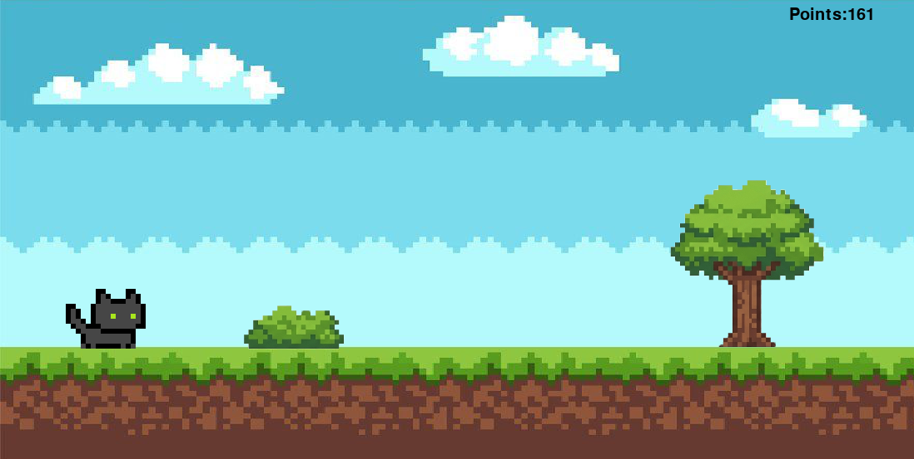
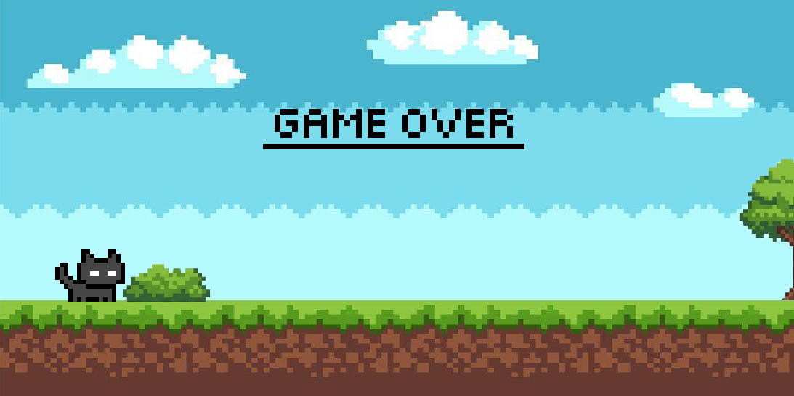
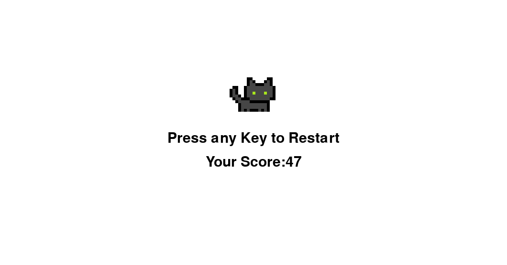

# User Guide

**Launching the Application**

To start the game, navigate to the root directory using a system terminal and execute the entry-point script:

```bash
python main.py
```

Upon execution, the Pygame graphical user interface initializes, rendering the primary window, loading all required game assets into local memory and resetting the game score tracking variable to zero.

**Core Gameplay and Controls**

The player controls an automated animated cat character that visually moves along a scrolling track. The game's primary objective is to survive for as long as possible by navigating past incoming threats (plants, gorges and bees) while the scroll speed increases over time.

The movement mechanics utilize straightforward, highly responsive keyboard inputs:
- **Up Arrow Key:** Triggers a jump animation to clear low-lying ground obstacles *(plants and gorges)*.
- **Down Arrow Key:** Triggers a ducking animation to slide underneath airborne hazards *(bees)*.

**Obstacle Management vs Decorative Elements**

Understanding the active gameplay grid is critical for survival, as not all visible environmental elements affect the character's collision state machine.

- **Active Ground Obstacles:**
Plants and gorges represent dangerous ground-level obstacles. Failing to jump over these elements triggers a collision event, immediately halting the game loop.
- **Active Airborne Obstacles:**
Bees fly across the screen. The player must use the down arrow key to duck underneath these flying objects to prevent a collision.
- **Decorative Elements:**
Trees and background scenery items are purely decorative. These visual assets pass behind the player character without registering physical contact. They are handled by a separate rendering layer that has no connection to the primary collision bounding box algorithm, meaning players do not need to jump over or duck under any trees.




**Game Over and Replay Mechanics**
When a collision registers between the player character's hitbox and an active hazard *(plant, gorge or bee)*, the game loop immediately pauses, the speed coefficient resets and a Game Over overlay is rendered onto the display view. 



To clear the state and instantly launch a new game session, the player can press any key on the keyboard.


